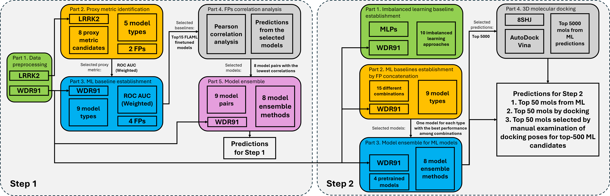
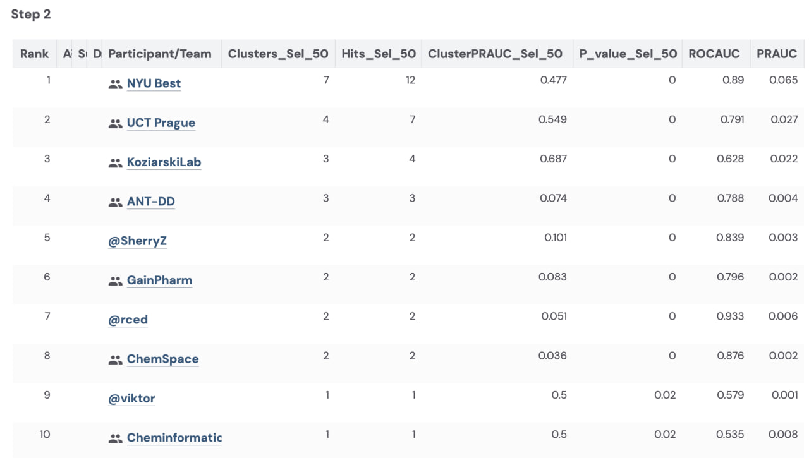

# A Hybrid AutoML and 3D Docking Workflow for DEL-ASMS-Based Prediction of WDR91 Binders

[[Benchmark](https://www.synapse.org/Synapse:syn65660836/wiki/632249)][[Implementation details](materials/A_Hybrid_AutoML_and_3D_Docking_Workflow_for_DEL_ASMS_Based_Prediction_of_WDR91_Binders_DREAM2025_Writeup.pdf)]

## Introduction
We introduce a two-step process to establish robust baselines for compound selection, leveraging automated machine learning (AutoML) and advanced molecular modeling for the DREAM Target 2035 Drug Discovery Challenge. 

Step 1 centers on the use of AutoML with molecular fingerprints, aiming to systematically optimize both classification accuracy and chemical diversity. This step encompasses data preprocessing, optimal metric identification with AutoML, baseline model training, fingerprint correlation analysis, cross-fingerprint model ensembling, and final test set prediction—each component building upon the previous to refine predictive performance.

Step 2 advances this framework by integrating machine learning models with state-of-the-art imbalanced learning techniques, utilizing both molecular fingerprints and SMILES representations. The focus expands to include performance evaluation with imbalanced learning methods, exploration of fingerprint concatenation strategies, and model ensembling. Distinctively, this step incorporates 3D docking analyses for the top predicted compounds, combining machine learning and structural docking predictions to enhance both classification outcomes and chemical diversity in the final selection. Together, these steps provide a comprehensive and systematic approach to compound selection, setting a strong baseline for subsequent innovation and benchmarking in the DREAM Target 2035 Drug Discovery Challenge.

## Benchmark

We are at the 3rd place of the Step 2 in the first DREAM Target 2035 Drug Discovery Challenge.
